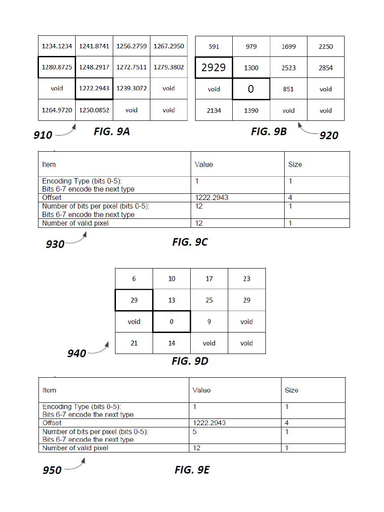

## The Main Principle of Lerc

This section demonstrates how the same block of 4x4 pixels with floating point values gets Lerc encoded using two different values for MaxZError, the user specified coding error tolerance. The following is taken from the Lerc patent. The Lerc patent is available in the doc folder.

#### Example of LERC Encoding For One Block Using MaxZError = 0.01 m

In some embodiments, LERC encoding can be performed using four simplified basic steps including, but not limited to, (1) calculating the basic statistics for a data block; (2) determining how to encode the block using a user defined MaxZError value, (3) determining the number of bits needed and bit stuffing the non-negative integers; and (4) writing the block header.  FIG. 9A depicts sample block data 910 for a 4 x 4 block of pixels, according to an embodiment of the invention.   It should be noted that blocks are typically 8 x 8 pixels or larger, but are shown here as 4 x 4 pixels for simplicity of description.  At step 1, the LERC method includes determining the basic statistics for the data block of FIG. 9A. The minimum value is 1222.2943 and the maximum value is 1280.8725. The number of valid pixels (i.e., non-void pixels) is 12 of 16.  The number of invalid pixels (i.e., void pixels) is 4 of 16. At step 2, the LERC method includes determining whether the pixel block should be encoded uncompressed or with a user-input MaxZError of 0.01 m. By using equation (1) above:

(Max-Min) / (2 x MaxZError) => (1280.8725-1222.2943) / (2 x 0.01) = 2,928.91.

Since this value is less than 2^30, we can quantize the pixel values in data block 910 and expect an acceptable compression ratio. The block is quantized using equation (2) above, where each new pixel value is calculated by:

n(i) = (unsigned int)((x(i) - Min) / (2 x MaxZError) + 0.5),

resulting in the new pixel block 920 shown in FIG. 9B. At step (3), the method further includes determining the number of bits needed and bit stuffing these non-negative integers. The number of bits needed can be determined by equation (3):

NumBits = ceil(log2(2929)) = 12

To represent the number of bits needed another way, 2^11 < 2929 < 2^12. In this case, 12 bits per number are needed to encode all numbers of block 910 lossless. There are 12 valid numbers, resulting in 12 x 12 = 144 bits total.  As 144 / 8 = 18, 18 bytes are needed to encode the entire data block.  At step (4), the method includes writing the block header as shown in FIG. 9C. It follows that 7 bytes are needed for the block header. The total number of bytes needed for block 920 can be calculated as 18 + 7 = 25 bytes.  In this particular case, the header takes too much space with respect to the raw pixel data, which exemplifies the need to work with block sizes of 8 x 8 pixels or larger.  

#### Example of LERC Encoding For One Block Using MaxZError = 1.0 m

Using the same 4 x 4 pixel block shown in FIG. 9A, the LERC method is performed again using a larger MaxZError (i.e., error threshold) of 1.0 m. Beginning with step (1), the minimum value is 1222.2943 and the maximum value is 1280.8725. The number of valid pixels (i.e., non-void pixels) is 12 of 16. The number of invalid pixels (i.e., void pixels) is 4 of 16. In step (2), the LERC method proceeds with determining whether the pixel block should be encoded uncompressed or with a user-input MaxZError of 1.0 m. As By using equation (1) above:

(Max-Min) / (2 x MaxZError) => (1280.8725-1222.2943) / (2 x 1.0) = 29.2891.

Since this value is less than 2^30, we can quantize the pixel values in data block 910 and expect an acceptable compression ratio.  The block is quantized using equation (2) above, where each new pixel value is calculated by:

n(i) = (unsigned int)((x(i) - Min) / (2 x MaxZError) + 0.5),

resulting in the new pixel block 940 shown in FIG. 9D. At step (3), the method further includes determining the number of bits needed and bit stuffing these non-negative integers. The number of bits needed can be determine by equation (3):

NumBits = ceil(log2(29)) = 5

To represent the number of bits needed another way, 2^4 < 29 < 2^5. In this case, 5 bits per number are needed to encode all numbers of block 940 lossless. There are 12 valid numbers, resulting in 5 x 12 = 60 bits total. As 60 / 8 = 7.5, 8 bytes are needed to encode the entire data block. At step (4), the method includes writing the block header as shown in FIG. 9E. It follows that 7 bytes are needed for the block header. The total number of bytes needed for block 920 can be calculated as 8 + 7 = 15 bytes.

## Demos

We are not going to repeat here the general benefits of good compression. However, Lerc is special in a number of ways. First, regarding speed, not only decode but also encode is very fast. This allows on-the-fly encode, transmit, decode. For instance, data residing on a server stored at high accuracy
(potentially also using Lerc, with a very small MaxZError = 0.0001) can be requested by a client at a much lower accuracy sufficient for display (let's say MaxZError = 0.1). Second, as Lerc supports all common data types, it can be used for numerical or scientific data, not just regular images.
Third, Lerc supports sparse images or raster with many pixels invalid or empty. Last not least Lerc is a standalone codec with no dependencies on other software packages or libraries. It is relatively easy to port from C++ to other languages such as JavaScript or Python, esp if only the decoder is needed. A JavaScript decoder can enable web browsers to directly display
compressed Lerc tiles.

Here are some examples of fast display using Lerc:

http://developers.arcgis.com/javascript/samples/layers_raster/

http://developers.arcgis.com/javascript/samples/layers_imageservicevector/

## History

Lerc started in 2010 as a fast caching method for single band 32 bit float rasters. At the time nobody could foresee that it would turn into a compression format for all common data types. Later we also tried it successfully on 16 bit integer satellite data. This first version, Lerc1, was mainly used for single band 32 bit float elevation services. Lerc1 uses float internally, every other input data type gets converted to float first.
Therefore the use of old Lerc1 is unsafe for data types that may not fit into 32 bit float, such as 32 bit integer or double.

Mainly for this reason Lerc was re-implemented from scratch in 2014. It is now fully templated C++, so it works for any input data type and any MaxZError down to 0 or lossless. We call it Lerc2. It has many other improvements over the previous version,
such as more info in the header. It is much faster, 2-4x, for both encode and decode. Lerc2 has been in use since then inside the Esri core software in multiple places for caching, transmission etc.

The latest addition was an improvement on 8 bit data compression. For 8 bit data, conventional compression methods yield usually better compression than Lerc, but are much slower. We added textbook Huffman coding for 8 bit data types, resulting in 10-30% better compression while keeping the high speed.
