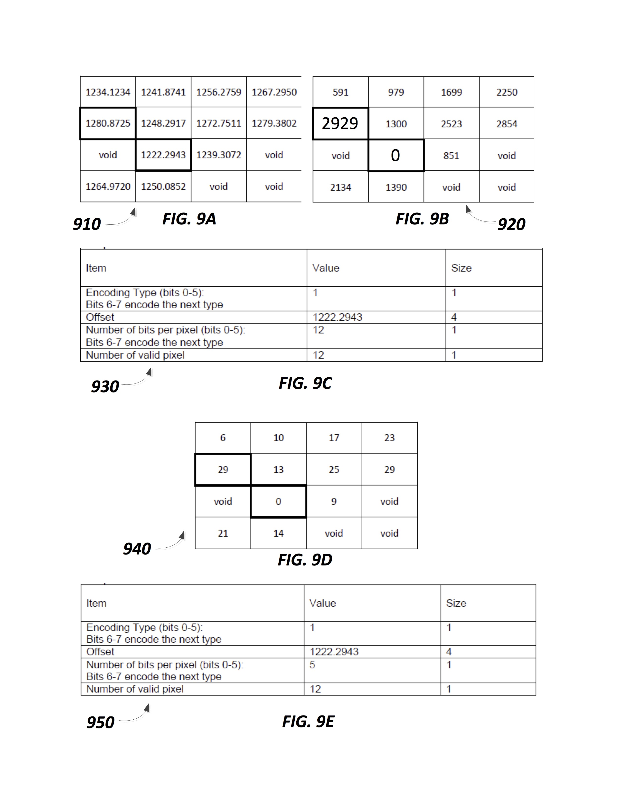

## To understand how Lerc works in less than 5 minutes
 

- Page 19 (lower right, end of column 10, “Example of Lerc encoding for one block …”) to page 20, end of column 11, in [LercPatent.pdf](https://github.com/Esri/lerc/blob/master/doc/LercPatent.pdf) contains an explanation for the above figures. 

This section demonstrates how the same block of 4x4 pixels with floating point values gets Lerc encoded using two different values for MaxZError, the user specified coding error tolerance.